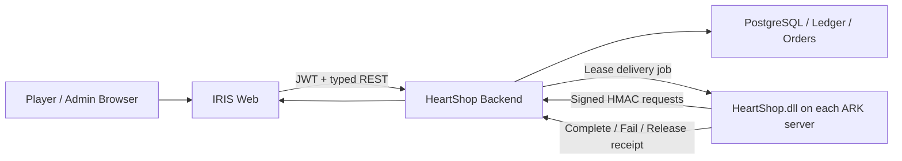

# IRIS HeartShop Web Rebuild — Master Plan & Antigravity Handoff

สถานะ: **Ready for execution**  
วันที่จัดทำ: **2026-08-12**  
ขอบเขต: `frontend/` และ presentation/integration layer ที่เรียก Backend เท่านั้น  
ระบบที่ต้องรักษา: Backend, database, HeartShop plugin contract และระบบ delivery ที่กำลังรันได้ดี

---

## 1. Mission

สร้างเว็บ IRIS HeartShop ใหม่ให้เป็นผลิตภัณฑ์ระดับ Hi-End ที่มีภาษาภาพเดียวกันทั้งระบบ ตั้งแต่หน้าแรก ร้านค้า ตลาดผู้เล่น กระเป๋าเงิน บัญชี ไปจนถึง Admin Operations โดยเว็บต้องทำหน้าที่เป็น **Control & Commerce Surface ของ ecosystem ในเกม** ไม่ใช่เพียงร้านค้าหน้าเว็บ

ผลลัพธ์ปลายทางต้องให้ผู้ใช้รู้สึกว่า:

- เว็บ เกม กระเป๋าเงิน ตลาด และ cluster เป็นระบบเดียวกัน
- ทุก action ที่มีผลต่อไอเทม/สัตว์/เงิน มีสถานะที่เข้าใจได้และตรวจสอบย้อนหลังได้
- หน้าสาธารณะดูหรู มีเอกลักษณ์ และน่าเชื่อถือ
- หน้าปฏิบัติการหนาแน่นแต่ยังอ่านง่าย ไม่กลายเป็น generic admin template
- ไม่มี emoji ทำหน้าที่แทน icon ใน production UI
- ไม่มีหน้าใดหลุดไปเป็นคนละธีม เช่น cyber HUD, laser dashboard หรือ Tailwind demo palette

### North-star statement

> **IRIS is the premium command layer between the survivor, the cluster, and every transaction that moves through it.**

---

## 2. Guardrails — สิ่งที่ห้ามทำเสียหาย

1. **ห้ามเปลี่ยน Plugin API contract เพื่อแก้หน้าตาเว็บ**
2. **ห้ามให้ Frontend คำนวณยอดเงิน ราคาสุทธิ ส่วนลด หรือผลลัพธ์ธุรกรรมเอง** Backend เป็น source of truth
3. **ห้ามเรียก Plugin โดยตรงจาก browser** เว็บเรียก Backend; Plugin เรียก signed `/api/plugin/**`
4. **ห้ามลดความปลอดภัยของ auth, signed plugin requests, delivery lease หรือ idempotency**
5. **ห้ามแสดง payment method ว่าใช้จริง ถ้า provider ยังไม่รองรับจริง**
6. **ห้ามใช้ fixture fallback ใน production** ต้อง fail closed ตาม contract client ปัจจุบัน
7. **ห้ามลบ route เดิมก่อน route ใหม่ผ่าน parity test**
8. **ห้ามรวมการ redesign กับ schema migration หรือ Plugin rewrite ใน change set เดียวกัน**

Backend และ Plugin ถือเป็น working infrastructure; งานนี้เป็น **frontend rebuild with contract preservation**

---

## 3. Evidence-based audit ของระบบปัจจุบัน

ตรวจจาก code, route, API contracts และหน้าเว็บที่รันจริง (`/`, `/shop`, `/topup`, `/profile`)

### 3.1 ตัวเลขปัจจุบัน

| Signal | Current state | ผลกระทบ |
|---|---:|---|
| Frontend source files | 78 | ขนาดเริ่มใหญ่พอที่จะต้องแบ่ง feature/domain |
| App routes | 36 | ต้องมี shell และ pattern ที่บังคับใช้ร่วมกัน |
| Client components | 53 | client boundary กว้างเกินจำเป็น มีผลต่อ bundle และ maintainability |
| Emoji lines | 57 | กระจายใน 17 ไฟล์และข้อมูล fixture |
| `Laser*` consumers | 26 | ยังมี legacy visual system ใช้งานกว้าง |
| `Glass*` consumers | 17 | มี design system ใหม่ซ้อนอยู่กับระบบเก่า |
| `ark-*` token uses | 226 | legacy palette ยังไม่ถูก retire |
| `iris-*` token uses | 651 | canonical palette เริ่มใช้งานแล้วแต่ยังไม่ครอบคลุม |
| raw Tailwind palette uses | 1,875 | semantic consistency ต่ำและแก้ theme ยาก |

### 3.2 สิ่งที่ดีและต้องรักษา

- หน้า Home มีฐาน luxury/editorial ที่ดี: Obsidian, Pearl, Cyan, Orchid และ Gold
- Navbar, Product Card และ Account Center เริ่มใช้ visual language เดียวกัน
- Catalog เชื่อมข้อมูลจริงและมีรูปสินค้า/สัตว์จำนวนมาก
- Frontend มี `lucide-react`, `framer-motion`, TanStack Query, Zustand และ typed contract layer แล้ว
- Cart ใช้ `(productId, serverId)` เป็น identity ถูกต้องตาม backend
- Checkout อ่านยอดจาก Backend และ frontend ไม่ทำ money math
- Production fixture policy fail closed แล้ว
- มี Playwright coverage สำหรับ Home, Auth, Shop, Product Detail, Cart, Checkout, Orders, Wallet, Profile และ Support

### 3.3 ปัญหาที่ต้องแก้

#### A. Visual language แตกเป็นหลายชุด

- `iris-*`: luxury/editorial ecosystem
- `ark-*`: neon/laser game dashboard
- raw `gray/emerald/cyan/yellow/red`: utility palette แบบไม่ผ่าน semantic token
- `LaserCard/LaserButton/LaserModal` ปนกับ `GlassCard/Button/Badge/Input`
- หน้า Top-up เป็น HUD สีเหลือง/ดำ ขณะที่ Home เป็น luxury editorial
- Admin เป็น emerald/cyan laser dashboard และไม่เหมือนทั้ง public site หรือ account area

#### B. Emoji ถูกใช้เป็น product UI icon

พบใน Shop category, Packs, Top-up payment methods, Chat channel, Ranking, Login และ Admin หลายหน้า รวมถึง category data จาก API/fixture การ render `category.icon` ตรง ๆ ทำให้ appearance ต่างกันตาม OS และลดความรู้สึกเป็นแบรนด์

#### C. Page/component monolith

ไฟล์ใหญ่ที่ต้องแตก feature เช่น:

- `admin/content/[id]/page.tsx` — 1,136 lines
- `admin/users/page.tsx` — 814 lines
- `admin/products/page.tsx` — 694 lines
- `home/HomeExperience.tsx` — 670 lines
- `ApiKeyManager.tsx` — 608 lines
- `admin/protection/page.tsx` — 586 lines
- `market/[id]/page.tsx` — 553 lines
- `cart/page.tsx` — 489 lines
- `topup/page.tsx` — 468 lines

#### D. API client ซ้อนสองแนว

- `src/lib/api.ts` มี direct endpoint groups และหลายจุดยังใช้ `any`
- `src/lib/contracts/client.ts` มี typed, contract-aligned clients และ fixture policy
- Antigravity ต้องรวมให้มี canonical transport/contract layer เดียว โดยไม่เปลี่ยน business contract

#### E. Payment UI แสดงมากกว่าความสามารถจริง

หน้า Top-up แสดง PromptPay, TrueMoney และบัตร แต่ Backend provider ที่ทำงานจริงใน code ปัจจุบันมีเพียง `sandbox` เท่านั้น นี่เป็น trust issue ระดับ P0: UI ใหม่ต้อง integrate `/api/payments/packages` และ `/api/payments/intents` จริง หรือแสดงสถานะ unavailable/sandbox อย่างตรงไปตรงมา

#### F. Information architecture กระจาย

36 routes ใช้ shell เดียว แต่ยังไม่มี product-area hierarchy ชัดเจนระหว่าง Public, Commerce, Account และ Operations ทำให้ component, loading state, page header และ density แตกต่างกัน

---

## 4. Creative direction — “Obsidian Expedition Ledger”

### 4.1 Concept

Luxury editorial ผสม expedition archive และ cluster telemetry: ความรู้สึกเหมือนฐานบัญชาการของนักสำรวจที่บันทึกทุก asset, creature และ transaction ผ่านเครือข่าย IRIS

ไม่ใช่ casino, crypto exchange, generic sci-fi HUD หรือ neon cyberpunk

### 4.2 Signature memory

ใช้ **Prismatic River Line** เป็นเส้นแสงบางที่ไหลผ่านหน้า/สถานะสำคัญ เปรียบกับสิ่งของและข้อมูลที่เดินทางข้าม cluster เส้นนี้ใช้เฉพาะจุดสำคัญ เช่น hero, checkout progress, delivery timeline และ server transfer—not every card

### 4.3 Palette roles

| Role | Token | Guidance |
|---|---|---|
| Canvas | Obsidian Navy | พื้นหลังหลัก 70–80% ของภาพ |
| Elevated surface | Deep River | card/panel ที่แยกจาก canvas |
| Primary action | Iris Cyan | action ที่ปลอดภัยและไปข้างหน้า |
| Identity/integration | Royal Orchid | Steam/Discord/linking/cluster identity |
| Value/premium | Champagne Gold | IC, ราคา, rarity, privilege |
| Primary text | Pearl | หัวข้อ/เนื้อหาสำคัญ |
| Secondary text | Mist | คำอธิบายและ metadata |
| Semantic success | Jade | สำเร็จ/delivered/online เท่านั้น |
| Semantic warning | Amber | pending/attention เท่านั้น |
| Semantic danger | Coral | failed/destructive/offline เท่านั้น |

ห้ามใช้ cyan, orchid และ gold เป็น accent พร้อมกันทุก component; แต่ละ section เลือกหนึ่ง dominant accent

### 4.4 Typography

- Display/Editorial: `Noto Serif Thai` สำหรับ hero, page title และ campaign statement
- UI/Body: `Anuphan` สำหรับ Thai/Latin interface ที่อ่านง่ายและมี character
- Numeric/technical: ใช้ `font-variant-numeric: tabular-nums`; ไม่เพิ่ม mono font ทุกจุด
- Thai เป็นภาษาหลัก; English เป็น eyebrow/caption ที่ช่วย hierarchy ไม่ใช่แทน label ไทย
- หลีกเลี่ยง ALL CAPS ยาว ๆ โดยเฉพาะ action และคำอธิบาย

### 4.5 Shape and surface

- Radius scale: `8 / 12 / 18 / 24 / 32`
- Pill ใช้เฉพาะ status, chip และ compact toggle; ไม่ใช้กับปุ่มและ card ทุกตัว
- Glass ใช้กับ navbar, overlay, modal และ floating control เท่านั้น
- Main content card ใช้ opaque/semi-opaque surface เพื่อ contrast และ performance
- Border 1px แบบ quiet; glow เป็น state feedback ไม่ใช่ decoration ตลอดเวลา

### 4.6 Motion

- Micro: 140–180ms
- Component transition: 220–320ms
- Page reveal: 450–650ms แบบ stagger ครั้งเดียว
- Delivery/cluster flow ใช้ directional motion เพื่อสื่อ state change
- ห้าม infinite pulse/glow ในตาราง, admin cards หรือสินค้าทุกชิ้น
- รองรับ `prefers-reduced-motion` ทุก effect

---

## 5. Icon system — Emoji-free production UI

### 5.1 Policy

1. ใช้ `lucide-react` เป็น default icon library
2. ใช้ icon size จาก scale `14 / 16 / 18 / 20 / 24 / 32`
3. Default stroke width `1.75`; compact/admin `1.5`; CTA ไม่เกิน `2`
4. Icon-only button ต้องมี `aria-label` และ tooltip เมื่อความหมายไม่ชัด
5. ไม่ render Unicode emoji จาก Backend ตรง ๆ
6. Gender symbols `♂/♀` เปลี่ยนเป็น `Mars/Venus` หรือ neutral metadata icon
7. Medal emoji เปลี่ยนเป็น `Medal`, `Trophy`, rank numeral และ semantic metal color

### 5.2 Category icon registry

สร้าง `src/design-system/icon-registry.tsx`:

```ts
export type IconKey =
  | 'all'
  | 'weapon'
  | 'creature'
  | 'dino'
  | 'aberrant'
  | 'x-creature'
  | 'r-creature'
  | 'tek'
  | 'wyvern'
  | 'aquatic'
  | 'armor'
  | 'saddle'
  | 'resource'
  | 'consumable'
  | 'structure'
  | 'skin'
  | 'chibi'
  | 'engram'
  | 'kit';
```

Registry map ต้องคืน React component ไม่ใช่ emoji string และมี fallback เป็น `PackageSearch`

### 5.3 Compatibility กับข้อมูลเดิม

ระยะ migration ให้ map `category.slug/name/icon` เดิมเป็น `IconKey` ใน adapter ฝั่ง frontend ห้ามบังคับ database migration ใน frontend change set แรก เมื่อระบบนิ่งค่อยเพิ่ม `iconKey` ใน Backend contract แล้ว deprecate emoji field

---

## 6. Target frontend architecture

รักษา URL เดิมทั้งหมด แต่จัด source ด้วย Next.js route groups:

```text
frontend/src/
├─ app/
│  ├─ (public)/          # home, event, promotion, packs, support, legal
│  ├─ (commerce)/        # shop, cart, orders, market, topup
│  ├─ (account)/         # profile, identity, data/privacy
│  ├─ admin/             # operations portal with its own shell
│  └─ design-system/     # internal visual QA only
├─ design-system/
│  ├─ tokens.css
│  ├─ icon-registry.tsx
│  ├─ motion.ts
│  └─ primitives/
├─ features/
│  ├─ catalog/
│  ├─ cart/
│  ├─ checkout/
│  ├─ orders/
│  ├─ wallet/
│  ├─ identity/
│  ├─ marketplace/
│  ├─ servers/
│  ├─ payments/
│  └─ admin-operations/
├─ lib/
│  ├─ api/               # transport + generated/typed contracts
│  ├─ query-keys.ts
│  └─ formatters.ts
└─ components/
   ├─ shell/
   ├─ shared/
   └─ feedback/
```

### Architecture rules

- Server Component by default; `'use client'` เฉพาะ interaction boundary
- TanStack Query ใช้ใน feature hooks ไม่เรียก API กระจัดกระจายใน page
- Zustand ใช้เฉพาะ local UI/cart draft ที่ต้อง persist; server state อยู่ Query cache
- สร้าง query-key factory เช่น `catalogKeys`, `walletKeys`, `orderKeys`
- แยก page orchestration ออกจาก presentational components
- เป้าหมาย page file ไม่เกินประมาณ 180–250 lines; component ไม่เกินประมาณ 250–300 lines
- `contracts/client.ts` เป็นฐาน canonical; ค่อยย้าย `api.ts` เป็น domain clients ที่ typed
- พิจารณา generate TypeScript types จาก `backend/contracts/openapi.yaml`
- Runtime mutations ต้อง normalize error ผ่าน `ContractApiError`

---

## 7. Unified shells

### 7.1 Public/Commerce shell

- Announcement rail แบบสงบ ไม่แย่ง navigation
- Brand mark + primary navigation 4–5 จุด
- Global search เปิด command palette สำหรับ product, creature, order และ help
- Wallet balance, cart, notification, account เป็น utility cluster เดียว
- Mobile ใช้ bottom action bar เฉพาะ commerce journey; ไม่ยัดทุก nav ลง hamburger

### 7.2 Account shell

- Sidebar/segmented navigation: Overview, Wallet, Orders, Identities, Security, Data & Privacy
- แสดง connection state, cluster eligibility และ delivery readiness อย่างชัดเจน
- Balance เป็น data point ไม่ใช่ decorative badge

### 7.3 Admin Operations shell

- แยกจาก public marketing shell แต่ใช้ token/typography/icon เดียวกัน
- Desktop: collapsible rail + command/search + contextual actions
- Mobile/tablet: read-mostly; destructive/bulk operation ต้องมี responsive review step
- Density modes: `comfortable` และ `compact`
- Section groups: Commerce, Players, Cluster, Content, Security, System

---

## 8. Information architecture และ page blueprint

### 8.1 Home `/`

เป้าหมาย: บอก ecosystem ภายใน 5 วินาทีและพาไป action หลัก

1. Hero: “เว็บ เกม และ cluster เดียวกัน” + search + primary CTA
2. Live cluster strip: online server, map, players, heartbeat freshness
3. Featured store: 4–6 products พร้อม real image
4. How delivery works: Purchase → Backend Ledger → Plugin Lease → In-game Receipt
5. Player market activity
6. Trust section: transaction traceability, signed plugin, delivery protection
7. Community/event CTA

### 8.2 Shop `/shop`

- Thai page title + concise English eyebrow
- Sticky filter rail desktop; filter sheet mobile
- Category icon registry ไม่มี emoji
- Search state อยู่ URL
- Quick filter: Items, Dinos, Deliverable now, Featured
- Product grid ปรับ density ได้ 3/4/5 columns ตาม viewport
- Card แสดง unit price, type, quality/level, server compatibility และ image status
- ไม่โหลด category ยาวทั้งหมดโดยไม่มี grouping; ใช้ collapsible taxonomy

### 8.3 Product detail `/shop/[id]`

- Large artwork/creature image
- Product facts แยกจาก purchase action
- Target server selector แสดง online/capability/compatibility
- Sticky purchase summary desktop/mobile
- “Add to cart” และ “Buy now” ต้องชัดว่า final price มาจาก checkout
- Delivery expectation และ prerequisites อยู่ใกล้ CTA

### 8.4 Cart + Checkout `/cart`

- Group line by target server
- Show server health and delivery capability
- Sync cart ครั้งเดียวก่อน create checkout session
- Checkout summary ใช้ Backend total เท่านั้น
- Handle 409 price/capability change ด้วย refresh quote UI
- Success state พาไป order detail ที่มี delivery timeline

### 8.5 Orders `/orders`, `/orders/[id]`

- Timeline language: Created → Paid → Queued → Leased → Delivered/Failed
- แสดง server, player, delivery receipt และ actionable error
- Pending delivery มี CTA `/claim` guidance และ server context
- Refund UI ต้องสะท้อน policy จาก Backend ไม่เดาเอง

### 8.6 Player market `/market/**`

- Listing card เน้น creature identity, stats, seller trust, price และ delivery target
- Gender ใช้ icon component ไม่ใช้ Unicode symbol
- Selling flow อธิบายว่าต้องเริ่มจาก `/sell <price>` ในเกม
- UI ต้อง fail closed ขณะ asset-lock protocol ยังไม่พร้อม
- แสดง escrow state และ return state ให้เจ้าของเห็น

### 8.7 Wallet + Top-up `/profile`, `/topup`

- Wallet เป็น ledger view ไม่ใช่คะแนนเกมลอย ๆ
- Balance, available, pending และ transaction history มี hierarchy ชัด
- Top-up ดึง package จาก `/api/payments/packages`
- Create intent ผ่าน `/api/payments/intents` พร้อม idempotency key
- Poll intent ผ่าน `/api/payments/intents/{id}` หรือใช้ event channel เมื่อพร้อม
- ระหว่างมีแค่ sandbox provider: แสดง `Sandbox / Testing` ชัดเจน และไม่แสดง PromptPay/TrueMoney/Card เป็น active option

### 8.8 Account & identity `/profile`

- Overview รวม Discord/Steam/Epic connection, server eligibility, pending delivery และ protection
- Steam linking ใช้ OpenID callback จริง
- Epic แสดง unavailable จน verified OAuth พร้อม
- Security แสดง active sessions และ revoke action
- Data & Privacy รักษา PDPA routes เดิม

### 8.9 Support `/support`

- Search-first help center
- Contextual help สำหรับ purchase, delivery, linking, top-up, market และ plugin/server
- สร้าง diagnostic bundle ฝั่ง UI จาก request ID/order ID/server ID โดยไม่เปิดเผย secret
- คำสั่งในเกมแสดงแบบ code token เช่น `/claim`, `/points`, `/sell <price>`

### 8.10 Admin `/admin/**`

- Overview: revenue, orders, delivery backlog, plugin health, heartbeat freshness
- Products/Categories: split list/detail, validation, artwork completeness, delivery definition
- Orders: filterable timeline, refund review, delivery retry visibility
- Servers: capabilities, plugin version, heartbeat, queue depth, circuit status
- Users/API Keys: role-aware actions, masked secrets, audit trail
- Content: block editor แตกเป็น composable panels; ห้ามคง 1,000+ line page
- Protection/Chat ranks: domain tables ใช้ shared DataTable pattern
- “Compile plugin” เป็น root-only system operation พร้อม explicit confirmation และ build result

---

## 9. Web ↔ Backend ↔ Plugin integration map



| Experience | Web contract | Plugin contract | UI state required |
|---|---|---|---|
| Catalog | `GET /products`, `/categories`, `/featured` | `GET /plugin/catalog` สำหรับ in-game shop | available, incompatible, unavailable |
| Server target | `GET /servers` | heartbeat/capability | online, stale, offline, unsupported |
| Purchase | `/cart/**`, `/checkout/session`, commit | delivery claim/complete/fail/release | quoting, committed, queued, delivered, failed |
| Wallet | `GET /wallet`, `/transactions` | `/player/{steamId}/wallet`, wallet events | available, pending, posted |
| Orders | `GET /orders/**` | delivery receipt | full timeline + request ID |
| P2P market | `GET/POST /market/**` | prepare/confirm lock, delivery/return | locked, listed, sold, returning, returned |
| Account link | `/auth/**`, identities, sessions | player lookup by Steam ID | linked, proof pending, unavailable |
| Protection | `/protection/me` | `/plugin/protection/**` | protected, expiring, inactive |
| Cluster health | admin servers/status | heartbeat + capability manifest | version, health, queue, last success |

### Critical purchase journey

1. User เลือก product และ target server
2. Frontend เก็บ cart draft ด้วย `(productId, serverId)`
3. Frontend sync cart กับ Backend
4. Backend สร้าง checkout quote/session และคำนวณ total
5. Frontend แสดง Backend total และ commit
6. Backend post ledger + order + delivery job
7. Plugin claim lease และทำ game mutation
8. Plugin ส่ง durable receipt
9. Backend settle order
10. Web order timeline update จาก server state

ทุกขั้นต้องมี loading, retry-safe, conflict และ failure UI; ห้ามแสดง success ก่อน Backend commit

---

## 10. Component migration matrix

| Current | Target | Action |
|---|---|---|
| `LaserCard` | `Surface`, `Panel`, `StatCard` | migrate แล้ว delete |
| `GlassCard` | `Surface` variants | refactor เป็น canonical primitive |
| `LaserButton` + `.btn-*` + `Button` | `Button` | รวม API/variants ชุดเดียว |
| `LaserModal` | `Dialog`, `ConfirmDialog` | รองรับ focus trap/ESC/ARIA |
| raw `<input>` + `.input` + `Input` | `Field`, `Input`, `SearchField` | รวม states/labels |
| raw `<select>` + `Select` | `SelectField` | canonical accessibility |
| ad-hoc badge/pill | `Badge`, `StatusChip` | semantic variants เท่านั้น |
| `AuroraBackground` | `AppBackdrop` | ไม่มี external remote noise asset |
| `AnimatedGrid` | `AmbientField` | static/low-motion; no infinite particles on ops pages |
| category emoji | `CategoryIcon` | map ผ่าน registry |
| ad-hoc loaders | `PageSkeleton`, `InlineSpinner` | shape ตรง content จริง |
| ad-hoc error blocks | `ErrorState` | request ID + retry/action |
| ad-hoc empty blocks | `EmptyState` | contextual action |
| admin cards/tables | `DataTable`, `MetricCard`, `FilterBar` | shared density/keyboard behavior |

หลัง migration ต้องลบ `ark` color namespace, `Laser*` components และ raw hex ที่ไม่ใช่ token definitions

---

## 11. Execution roadmap

### Phase 0 — Freeze, baseline, truthfulness (P0)

ระยะเวลาแนะนำ: 1–2 วัน

- เก็บ screenshot baseline ของ 36 routes ที่ desktop/mobile
- บันทึก current Playwright results และ build size
- เพิ่ม UI feature flag `NEXT_PUBLIC_UI_V2`
- แก้ Top-up ไม่ให้แสดง provider ปลอมเป็น active
- ห้ามเปลี่ยน Backend/Plugin contract ใน phase นี้

**Gate 0:** build ผ่าน, tests เดิมผ่าน, payment UI ไม่กล่าวอ้างเกินระบบจริง

### Phase 1 — Design foundation

ระยะเวลาแนะนำ: 3–5 วัน

- canonical tokens + typography + semantic colors
- icon registry และ emoji adapter
- primitives: Button, Surface, Field, Select, Badge, Status, Dialog, Tabs, Tooltip, Skeleton, Empty, Error
- Public shell, Account shell, Admin shell
- update `/design-system` ให้เป็น visual QA fixture
- ESLint/custom checks ห้าม emoji, `ark-*`, `Laser*`, raw palette ในไฟล์ใหม่

**Gate 1:** primitives ผ่าน keyboard, focus, reduced-motion และ contrast tests

### Phase 2 — Core commerce journey

ระยะเวลาแนะนำ: 5–8 วัน

- Shop catalog
- Product detail
- Cart drawer/page
- Checkout states
- Orders list/detail
- Server compatibility/status components

**Gate 2:** Playwright happy path Filter → Detail → Cart → Quote → Commit → Order timeline ผ่าน โดยไม่เปลี่ยน plugin

### Phase 3 — Account, wallet, payment, support

ระยะเวลาแนะนำ: 4–7 วัน

- Profile/Account shell
- Wallet + Ledger
- Steam identity + sessions
- Top-up integrate sandbox API จริง
- Protection status
- Support/diagnostics

**Gate 3:** auth/link/wallet/top-up sandbox flows ใช้ backend state จริงและ error states ครบ

### Phase 4 — Marketplace and ecosystem surfaces

ระยะเวลาแนะนำ: 4–6 วัน

- Marketplace browse/detail/my listings/my purchases
- Event, promotions, packs, ranking
- Chat widget icon/message cleanup
- In-game command reference and delivery guidance

**Gate 4:** P2P pages fail closed ตาม capability flag และไม่เปิด flow ที่ asset lock ยังไม่พร้อม

### Phase 5 — Admin Operations rebuild

ระยะเวลาแนะนำ: 7–12 วัน

- Admin shell and route-level permission gates
- Overview metrics/plugin health
- Products/categories
- Orders/refunds
- Servers/capabilities/API keys
- Users/roles
- Protection/chat ranks
- Content builder decomposition

**Gate 5:** role matrix, destructive confirmations, audit visibility และ 1280px/1440px operational layouts ผ่าน

### Phase 6 — Hardening and cutover

ระยะเวลาแนะนำ: 3–5 วัน

- accessibility audit
- mobile/tablet QA
- performance optimization
- visual regression
- full E2E
- remove old theme/components/tokens
- canary deploy + rollback verification

**Gate 6:** ไม่มี `Laser*`, `ark-*`, production emoji icons หรือ fake provider UI เหลือ

---

## 12. Atomic work packages สำหรับ Antigravity

| ID | Priority | Work package | Acceptance |
|---|---|---|---|
| WEB-RB-001 | P0 | Baseline audit automation | capture ทุก route 1440/390, report console/network errors |
| WEB-RB-002 | P0 | Payment truthfulness | top-up ใช้ `/payments/packages`; unsupported provider ไม่ selectable |
| WEB-RB-003 | P0 | Canonical tokens | semantic tokens ครบ, theme references อยู่จุดเดียว |
| WEB-RB-004 | P0 | Icon registry | emoji UI เป็น 0; API legacy icon มี adapter/fallback |
| WEB-RB-005 | P0 | Core primitives | Story/design-system states + keyboard/a11y tests |
| WEB-RB-006 | P0 | Shared shell | responsive nav/search/cart/account; no route regressions |
| WEB-RB-007 | P1 | API client consolidation | typed domain clients, no new `any`, production fail closed |
| WEB-RB-008 | P1 | Catalog rebuild | URL filters, grouped taxonomy, responsive grid, loading/empty/error |
| WEB-RB-009 | P1 | Product detail | real asset, server capability, cart actions, delivery expectations |
| WEB-RB-010 | P1 | Cart/checkout | backend total only, 409 recovery, idempotent commit UX |
| WEB-RB-011 | P1 | Orders/delivery timeline | lease/receipt states understandable and actionable |
| WEB-RB-012 | P1 | Account shell | overview/wallet/orders/identity/security/privacy cohesive |
| WEB-RB-013 | P1 | Wallet/ledger | decimal strings preserved; timeline and subaccounts clear |
| WEB-RB-014 | P1 | Top-up sandbox integration | create/get intent real, clear testing label, no fake success |
| WEB-RB-015 | P1 | Market rebuild | creature facts, escrow states, capability fail-closed |
| WEB-RB-016 | P2 | Marketing/content surfaces | event/promotion/packs/ranking/support use same system |
| WEB-RB-017 | P1 | Admin shell | role-aware nav, compact density, responsive operations |
| WEB-RB-018 | P1 | Admin domain pages | split monoliths, shared tables/forms/dialogs |
| WEB-RB-019 | P0 | Accessibility | WCAG 2.2 AA, focus, labels, reduced motion, contrast |
| WEB-RB-020 | P1 | Performance | LCP/CLS/INP budgets, image sizes, client-boundary reduction |
| WEB-RB-021 | P0 | E2E + visual regression | critical journeys + route screenshot matrix |
| WEB-RB-022 | P0 | Cutover/cleanup | flag rollout, remove legacy visuals, rollback documented |

Antigravity ต้องทำทีละ work package หรือเป็นชุดเล็กที่ review ได้ ห้ามแก้ 36 routes ใน commit เดียว

---

## 13. Acceptance criteria ระดับระบบ

### Visual consistency

- [ ] ไม่มี emoji เป็น icon ใน production UI
- [ ] ไม่มี `LaserCard`, `LaserButton`, `LaserModal` ถูก import
- [ ] ไม่มี `ark-*` token ใน frontend source
- [ ] raw palette เหลือเฉพาะ semantic implementation ภายใน design system
- [ ] page header, loading, empty, error และ action hierarchy ใช้ pattern เดียวกัน
- [ ] Public/Commerce/Account/Admin มี density ต่างกันได้ แต่เป็นแบรนด์เดียวกัน

### Commerce integrity

- [ ] Frontend ไม่คำนวณ final price/discount/balance
- [ ] Cart identity เป็น `(productId, serverId)`
- [ ] Checkout commit มี idempotency/error recovery
- [ ] UI ไม่บอก delivered จน Backend รับ receipt
- [ ] Server incompatibility/offline ป้องกัน action ก่อน checkout
- [ ] P2P fail closed เมื่อ capability/asset lock ไม่พร้อม

### Plugin integration

- [ ] ไม่มี browser call ไป `/api/plugin/**`
- [ ] หน้า server/admin สะท้อน heartbeat freshness และ capability
- [ ] order timeline แยก queued/leased/delivered/failed/released
- [ ] `/claim`, `/points`, `/sell`, `/market`, `/protection` แสดงเป็นคำสั่ง ไม่ใช่ปุ่มจำลอง
- [ ] HeartShop plugin tests/DLL ไม่ต้องเปลี่ยนเพราะ visual rebuild

### Accessibility

- [ ] WCAG 2.2 AA contrast
- [ ] keyboard-only ใช้ได้ทุก critical journey
- [ ] focus-visible ไม่ถูกซ่อน
- [ ] icon-only control มี accessible name
- [ ] dialog focus trap/restore ถูกต้อง
- [ ] reduced-motion ครอบคลุม animation ทั้งหมด
- [ ] touch target อย่างน้อย 44×44px ใน mobile action สำคัญ

### Performance budgets

- LCP ≤ 2.5s บน production-like connection
- CLS ≤ 0.1
- INP ≤ 200ms เป้าหมาย
- Product grid ใช้ responsive image sizes และ stable aspect ratio
- ไม่โหลด animation library ใน route ที่ไม่ใช้
- ลด client component ratio จาก 53/78 โดยย้าย static/page composition กลับ Server Components

### Quality gates

- `npm run lint`
- `npm run build`
- `npm run test:e2e`
- screenshot matrix: 390×844, 768×1024, 1280×800, 1440×900
- no horizontal overflow
- no uncaught console error
- no failed critical API request ใน happy path

---

## 14. Definition of Done ต่อหน้า

หน้าใดจะถือว่า rebuild เสร็จเมื่อ:

1. ใช้ canonical shell/primitives/tokens/icons เท่านั้น
2. รองรับ loading, empty, error, unauthorized, offline และ success state ที่เกี่ยวข้อง
3. URL state/back-forward ทำงานสำหรับ filter/tab ที่ควร share ได้
4. API contract typed และไม่มี client-side business rule
5. Keyboard + screen reader semantics ผ่าน
6. Desktop/tablet/mobile ไม่มี overflow
7. Page-level E2E และ screenshot baseline ผ่าน
8. ไม่มี fixture data หลุด production
9. Thai copy ชัดเจน; English เป็น supporting hierarchy
10. Antigravity อัปเดต checklist และบันทึกไฟล์/contract ที่แตะ

---

## 15. Rollout strategy

ใช้ strangler migration ภายใน frontend:

1. เพิ่ม canonical design system โดยยังไม่ลบของเก่า
2. เปิด route ใหม่ทีละกลุ่มหลัง parity test
3. ใช้ `NEXT_PUBLIC_UI_V2` หรือ route-level flag สำหรับ canary
4. Deploy frontend only ก่อน; Backend/Plugin ไม่เปลี่ยน
5. Monitor auth, product, cart, checkout, order, payment และ server-status errors
6. เมื่อ route group ผ่านแล้วจึงลบ legacy imports/tokens
7. ปิด flag และลบ fallback หลัง stabilization

Rollback ต้องเป็นการย้อน frontend image/version โดยไม่ rollback database หรือ Plugin

---

## 16. Decisions ที่ใช้เป็นค่าเริ่มต้น

เพื่อให้ Antigravity เริ่มได้โดยไม่ต้องรอ:

- รักษา dark theme เป็น primary theme
- รักษา Obsidian/Cyan/Orchid/Gold brand palette แต่เปลี่ยนเป็น semantic tokens
- ใช้ Lucide เป็น icon system หลัก
- รักษา URL ทั้ง 36 routes
- รักษา Next.js, Tailwind, TanStack Query, Zustand และ Framer Motion
- ไม่เพิ่ม shadcn migration ทั้งระบบในรอบแรก; สร้าง primitives ที่เข้ากับ code เดิม
- ใช้ Plugin/Backend contract ที่มีอยู่เป็น source of truth
- Payment provider production จริงเป็น separate backend project; UI รอบนี้รองรับ sandbox อย่างซื่อสัตย์
- โดเมน production และ OAuth callback ต้องยืนยันก่อน cutover; ห้าม hardcode domain ใหม่

สิ่งที่ต้องขอเจ้าของระบบยืนยันก่อนเปิด production เท่านั้น:

1. production web domain
2. payment provider จริงและ webhook contract
3. marketplace asset-lock capability พร้อมใช้งานหรือยัง
4. content/copy final สำหรับ legal/payment/refund

คำตอบเหล่านี้ไม่ block Phase 0–2

---

## 17. Kickoff prompt สำหรับส่งให้ Antigravity

คัดลอกข้อความต่อไปนี้พร้อมแนบ repository:

```text
คุณรับผิดชอบ rebuild frontend ของ IRIS HeartShop ตามไฟล์
ANTIGRAVITY_WEB_REBUILD_MASTER_PLAN_TH.md

กฎสำคัญ:
1. Backend, database และ HeartShop plugin กำลังทำงานดี ห้ามเปลี่ยน contract เพื่อแก้ UI
2. เริ่มจาก WEB-RB-001 ถึง WEB-RB-006 เท่านั้น และรายงานก่อนเริ่ม Phase 2
3. ใช้ frontend/src/lib/contracts/client.ts และ backend/contracts/openapi.yaml เป็น contract source
4. ห้าม frontend คำนวณ final price, discount, wallet balance หรือ delivery result
5. ห้าม emoji เป็น icon; ใช้ Lucide ผ่าน icon registry
6. ห้ามเพิ่ม ark-* หรือ Laser* usage ใหม่
7. Production fixture mode ต้อง fail closed
8. ทำงานเป็น small reviewable changes; อย่า rewrite 36 routes ในครั้งเดียว
9. ก่อนแก้ route ให้เก็บ baseline screenshot และ test result
10. ทุก work package ต้องส่ง: changed files, tests, screenshots, risks, rollback note

เริ่มด้วยการอ่าน:
- ANTIGRAVITY_WEB_REBUILD_MASTER_PLAN_TH.md
- ENTERPRISE_REDESIGN_PLAN_TH.md
- IRIS_CLUSTER_COMMERCE_PLATFORM_SPEC_TH.md
- TEAM_OWNERSHIP.md
- backend/contracts/openapi.yaml
- ark-plugin/INTEGRATION_AUDIT.md
- frontend/src/app/globals.css
- frontend/tailwind.config.ts
- frontend/src/lib/contracts/client.ts
- frontend/tests/e2e/

จากนั้นทำ WEB-RB-001: baseline audit automation และส่ง audit report ก่อนแก้ visual code
```

---

## 18. Reference files ใน repository

- `ENTERPRISE_REDESIGN_PLAN_TH.md` — product/enterprise background
- `IRIS_CLUSTER_COMMERCE_PLATFORM_SPEC_TH.md` — plugin-first ecosystem model
- `MASTER_COMPLETION_PLAN_TH.md` — broader delivery gates
- `TEAM_OWNERSHIP.md` — authority boundaries
- `backend/contracts/openapi.yaml` — API contract
- `ark-plugin/INTEGRATION_AUDIT.md` — plugin commands, contracts และ risks
- `frontend/src/app/globals.css` — current IRIS tokens
- `frontend/tailwind.config.ts` — current duplicate palettes ที่ต้อง consolidate
- `frontend/src/app/design-system/page.tsx` — current visual QA surface
- `frontend/tests/e2e/` — existing behavior baseline
- `frontend/verify-catalog-dinos.png` — current catalog visual reference

---

## 19. Final outcome

เมื่อแผนนี้เสร็จสมบูรณ์ ผู้เล่นต้องเห็น IRIS เป็นระบบเดียว:

**Discover → Purchase/Trade → Select Cluster Target → Backend Authorizes → Plugin Delivers → Receipt Appears in Web**

โดยทุกหน้ามีความหรู น่าเชื่อถือ อ่านง่าย และรักษาความถูกต้องของ ecosystem ที่ Plugin ทำงานอยู่แล้ว
