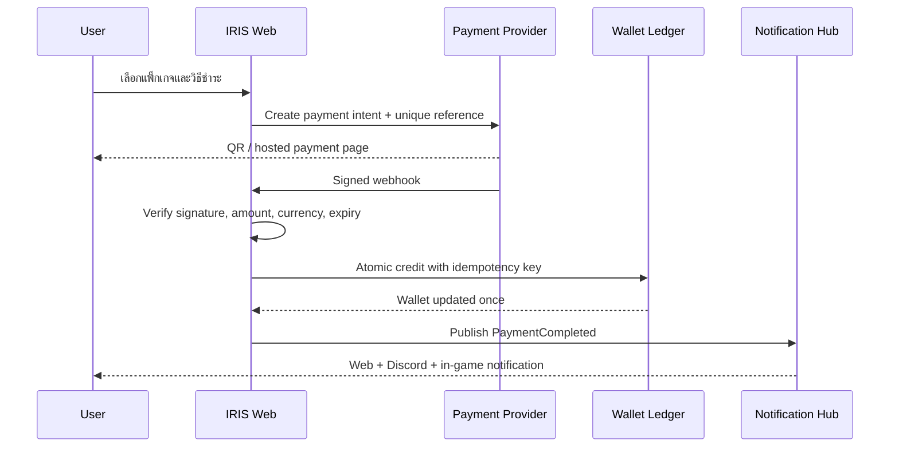
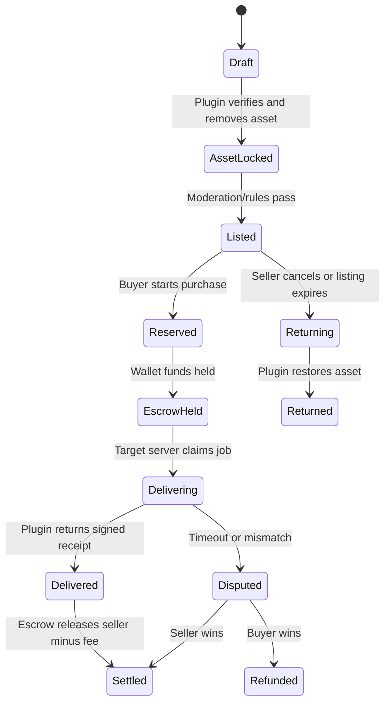

# IRIS Thailand Enterprise Commerce Redesign Plan

สถานะ: Draft v0.2 — Ecosystem & Commerce Expansion  
วันที่ตรวจระบบ: 20 มิถุนายน 2026  
เป้าหมาย: รวมเว็บไซต์ข้อมูล `www.iris-th.cloud` และระบบ HeartShop ให้เป็นแพลตฟอร์ม e-commerce สำหรับชุมชน ARK ที่ครบวงจร ใช้งานจริง วัดผลได้ และบริหารสิทธิ์อย่างปลอดภัย

## 1. ขอบเขตที่ตรวจแล้ว

- สำรวจ workspace 37,057 ไฟล์ และแยก source ที่เกี่ยวข้องออกจาก `node_modules`, build artifact และ binary
- ตรวจ frontend Next.js 14 จำนวน 32 page components, shared components, state, API client และ E2E tests
- ตรวจ backend Express/TypeScript, Prisma schema, controllers, routes, auth middleware, Redis, Socket.IO และ tests
- ตรวจ ARK plugin ทั้งชุดหลักและชุด HeartShop C++ เพื่อยืนยัน flow การส่งสินค้าเข้าเกม
- เปิดและสำรวจเมนูสาธารณะของ `www.iris-th.cloud` รวม Home, Rules, Status, Server Lists, Events, Promotion, Commands, Creatures, Items, Boss Arenas และ Unlock Engrams
- ตรวจ HTML และ HTTP ของทุก static route หลักบน `https://localhost/`
- ตรวจ Docker services, TLS proxy และสถานะ production build/test

หมายเหตุ: dependency, generated file, object file, source map และ binary ถูกทำ inventory แต่ไม่ใช่ไฟล์ที่ควรอ่านทีละบรรทัดในการออกแบบระบบ

## 2. ข้อค้นพบสำคัญ

### ระบบเดิมที่นำมาต่อยอดได้

- สถาปัตยกรรมหลักมีครบ: Next.js, Express, PostgreSQL/Prisma, Redis, Socket.IO, Discord/Steam auth, Docker/Nginx และ ARK plugin
- backend tests ผ่าน 44/44 tests
- มีระบบสินค้า หมวดหมู่ คำสั่งซื้อ แต้ม ตลาดไดโน CMS media/content, PDPA, audit log, server status และ plugin delivery
- backend มี RBAC จริง 4 ระดับ: `user`, `server_admin`, `admin`, `root`
- Docker services หลักทำงานและ health check ผ่าน

### ช่องว่างที่ต้องแก้ก่อนเรียกว่า Enterprise E-commerce

- `localhost` ไม่สามารถเป็นปลายทาง production หรือทำ SEO ได้ ต้องใช้เป็น development/staging เท่านั้น แล้ว cut over กลับสู่โดเมนจริง
- ทุกหน้าบน localhost ใช้ title และ description ชุดเดียว ไม่มี canonical, sitemap, robots, Open Graph หรือ structured data
- `<html lang="en">` ไม่ตรงกับเนื้อหาไทย
- หน้าเกือบทั้งหมดเป็น client component ทำให้ SEO, initial render และ performance ต่ำกว่าที่ควร
- ไม่มี Next.js middleware หรือ server-side route guard สำหรับ admin pages; backend ป้องกัน API แล้ว แต่ UI route ยังเปิด shell ได้
- หน้า Event, Promotion, Packs, Ranking, Support FAQ และบางส่วนของ Home ยังใช้ mock/hardcoded data
- social links และ Discord link หลายจุดเป็น placeholder
- catalog เดิมมีข้อมูลจำนวนมาก แต่ยังเป็นข้อความ `/buy ...` ไม่ใช่ product data ที่ค้นหา กรอง ซื้อ ชำระ และติดตาม order ได้ครบ
- Homepage แสดงตัวเลข online players, sales และ leaderboard แบบ fallback/mock ซึ่งทำลายความน่าเชื่อถือ
- frontend production build ล้มเหลวจาก lockfile/SWC และ symlink/readlink ใน `node_modules`; ต้องแก้ reproducible build ก่อน redesign ใหญ่
- frontend ใช้ Next.js 14 แต่ `eslint-config-next` เป็น 16 ซึ่งเป็น version skew
- UI ปัจจุบันมีทิศทาง gaming dashboard แต่ยังไม่ใช่ premium commerce และมีข้อความอังกฤษมากเกินกลุ่มผู้ใช้ไทย
- Footer อ้าง ISO 9001/27001 โดยไม่มีหลักฐาน หากไม่ได้รับ certification จริงต้องนำออก

## 3. Product Vision

สร้าง “IRIS Prism Palace” — digital flagship ของ IRIS Thailand ที่รวม 4 ประสบการณ์ในระบบเดียว:

1. Discover: รู้จักเซิร์ฟเวอร์ กติกา แผนที่ กิจกรรม และ community
2. Commerce: ค้นหา เปรียบเทียบ ซื้อ ชำระ และรับสินค้าเข้าเกม
3. Player Hub: ดู wallet, orders, dinos, rewards, protection และ support
4. Operations: Admin Portal สำหรับ content, catalog, order, payment, user, server และ audit

North-star metric: อัตราผู้ใช้จาก Product Detail ไปสู่ Delivered Order โดยวัดแยกตาม category, campaign และ server

## 4. Design Direction — Iconic Siam Ultra View

แนวทางไม่ใช่การลอก ICONSIAM แต่แปลงความรู้สึก “แลนด์มาร์กไทยร่วมสมัย + luxury river light + scale ที่ยิ่งใหญ่” ให้เป็นภาษาของ IRIS

- Mood: cinematic luxury, monumental, contemporary Thai, premium gaming
- Base: Obsidian Navy `#05070D`, Deep River `#071A24`
- Brand light: Iris Cyan `#37E5D2`, Royal Orchid `#A77BFF`
- Luxury accent: Champagne Gold `#DDBB72`
- Surface: smoked glass, polished metal, prism refraction, subtle Thai geometric linework
- Typography: display ไทยแบบ editorial คู่กับ sans-serif ไทยที่อ่านง่าย; หลีกเลี่ยง font generic และตัวพิมพ์ใหญ่ทั้งหน้าจอ
- Signature moment: hero “Prismatic River Gate” เคลื่อนแสงตาม scroll อย่างประหยัดและปิดได้เมื่อผู้ใช้เลือก reduced motion
- Product photography ต้องเด่นกว่ากรอบ UI; animation ใช้กับ reveal, cart และ delivery state ไม่ใช้รบกวนการอ่าน
- Accessibility: WCAG 2.2 AA, keyboard navigation, visible focus, contrast, alt text และ reduced motion

## 5. Information Architecture

### Public Header

- Logo / Home
- Shop: Creatures, Items, Armor, Skins, Chibi, Boss, Engrams, Packs
- Servers: Live Status, PVE, PVE Mod, PVPVE, Maps
- Events & Promotions
- Guides: Commands, VIP, Rules, FAQ
- Community: Ranking, Discord, Support
- Search, Language TH/EN, Wallet, Cart, Account

### User Area

- Overview
- Wallet & Top-up
- Cart & Checkout
- Orders and delivery timeline
- My Dinos / Marketplace listings / purchases
- Rewards, VIP and protection
- Account linking: Discord + Steam
- Privacy and consent center
- Support tickets

### Admin Portal

- Executive dashboard
- Catalog and inventory
- Categories, attributes and media
- Orders, payment reconciliation, refunds and delivery retry
- Promotions, coupons, campaigns and packs
- Users, roles, bans and wallet adjustments
- Servers, status, API keys and plugin health
- Marketplace moderation
- CMS, navigation and SEO editor
- Support operations
- Audit, security and PDPA

## 6. Roles and Permissions

ไม่ควรลดเหลือ boolean `isAdmin` เพราะระบบเดิมรองรับ least privilege อยู่แล้ว

| Role | ขอบเขต |
|---|---|
| `user` | ซื้อสินค้า ดูข้อมูลตนเอง ใช้ marketplace และ support |
| `server_admin` | ดูแลผู้ใช้/API key/operation เฉพาะ server ที่ได้รับมอบหมาย |
| `admin` | ดูแลเว็บไซต์ catalog, content, orders, campaigns และ refund |
| `root` | จัดการ role, servers, plugin build, security และ system configuration |

ทุก action สำคัญต้องตรวจสิทธิ์ที่ backend, จำกัดข้อมูลตาม scope, บันทึก audit log และใช้ step-up confirmation สำหรับ refund, role change, key rotation และ destructive actions

## 7. Target Technical Architecture

- Next.js App Router ใช้ Server Components เป็นค่าเริ่มต้น
- route groups แยก `(marketing)`, `(commerce)`, `(account)` และ `(admin)`
- Backend คง Express/Prisma ในระยะแรกเพื่อลด migration risk
- BFF/API client แบบ typed contract; ยกเลิก `any` ใน commerce-critical paths
- PostgreSQL เป็น source of truth, Redis สำหรับ cache/session/rate limit/job coordination
- queue/outbox สำหรับ payment webhook และ in-game delivery เพื่อให้ retry/idempotency ถูกต้อง
- object storage + image optimization สำหรับ media/catalog
- server-side auth guard + backend RBAC/ABAC
- OpenTelemetry, structured logs, error tracking, metrics และ alerting
- CI ทำ lint, typecheck, unit, integration, E2E, accessibility, build และ container scan

## 8. Commerce Domain ที่ต้องเติม

- Product variant ตาม server/mode/quality/level/quantity
- Cart แบบ persisted และตรวจราคาใหม่ก่อน checkout
- Order state machine: `draft -> pending_payment -> paid -> queued -> delivering -> delivered` พร้อม `failed/refunded/cancelled`
- idempotency key สำหรับ checkout, webhook และ plugin delivery
- payment transaction ledger แยกจาก points ledger
- promotion engine: coupon, bundle, threshold, segment, schedule และ usage limit
- stock/availability rule ต่อ server และ maintenance window
- invoice/receipt และ reconciliation
- admin retry/compensating action พร้อม audit
- search index สำหรับชื่อไทย/อังกฤษ command และ taxonomy

## 9. SEO และ Content Migration

- Production URL ต้องอยู่บน `https://www.iris-th.cloud`; localhost ใช้เฉพาะทดสอบ
- สร้าง route map และ 301 redirect จาก Google Sites URL เดิมทุกหน้า
- เปลี่ยน catalog ข้อความเดิมเป็น structured product/category records
- ใช้ per-page metadata: title, description, canonical, Open Graph, Twitter card และ hreflang
- เพิ่ม `robots.txt`, XML sitemap แยก content/product/category และ image sitemap
- Structured data: Organization, WebSite/SearchAction, BreadcrumbList, Product, Offer, ItemList, FAQ และ Event
- server-render หน้า category/product/rules/server; หน้า account/admin ตั้ง `noindex`
- เขียน alt text จากชื่อสินค้าและบริบท ไม่ใช้ filename
- เพิ่ม breadcrumb, internal linking, clean slug และ pagination ที่ crawl ได้
- ตั้ง Google Search Console, GA4/consent mode หรือ privacy-first analytics ตามนโยบายที่เลือก
- ติดตาม Core Web Vitals: LCP <= 2.5s, INP <= 200ms, CLS <= 0.1 ที่ p75

## 10. Migration Strategy

ใช้ Strangler migration เพื่อไม่ต้องหยุดระบบเดิมทั้งก้อน

### Phase 0 — Stabilize (1–2 สัปดาห์)

- แก้ frontend build และ lockfile/version skew
- ยืนยัน backup/restore และสร้าง staging domain ที่มี certificate ถูกต้อง
- inventory route, API, database, plugin command และ content แบบ export ได้
- ลบ claim/placeholder ที่ไม่จริงและปิด mock metric บน production
- กำหนด design token, coding standard และ Definition of Done

### Phase 1 — Foundation (2–3 สัปดาห์)

- สร้าง app shell ใหม่, responsive header/footer, navigation และ design system
- ทำ server-side auth guard และ permission-aware navigation
- วาง observability, analytics consent, error states, empty states และ loading strategy
- ทำ SEO foundation, sitemap, robots และ metadata framework

### Phase 2 — Content & Discovery (2–4 สัปดาห์)

- ย้าย Home, Rules, Server Status, Server Lists, Commands, VIP และ Guides
- สร้าง CMS content types แทน page block แบบ generic ในส่วนที่มี schema ชัดเจน
- ทำ TH/EN, search, breadcrumbs และ redirects

### Phase 3 — Commerce Core (4–6 สัปดาห์)

- catalog normalization, product/category/detail, filters และ search
- cart, checkout, wallet/payment, order state machine และ delivery tracking
- migration สินค้า Creatures/Items/Skins/Armor/Chibi/Boss/Engrams
- E2E ครบ happy path, payment failure, delivery retry, refund และ concurrent purchase

### Phase 4 — Player & Marketplace (3–5 สัปดาห์)

- Player Hub, linked accounts, rewards/VIP/protection
- Dino marketplace listing/purchase/moderation
- support ticket และ notification center

### Phase 5 — Admin Operations (3–5 สัปดาห์)

- dashboard ที่ใช้ข้อมูลจริง
- catalog/content/campaign/order/payment/user/server management
- bulk operation, approval workflow, audit explorer และ export

### Phase 6 — Cutover (1–2 สัปดาห์)

- content freeze และ final delta migration
- regression, load, accessibility, SEO crawl และ disaster-recovery rehearsal
- canary traffic, monitor, rollback window และ 301 activation
- ส่ง sitemap และติดตาม index/404/redirect/Core Web Vitals หลังเปิดระบบ

## 11. Definition of Done สำหรับทุกหน้า

- ทุกปุ่มมี state: default, hover, focus, loading, success, error และ disabled
- ไม่มี dead link, placeholder action หรือ mock data ใน production
- responsive ที่ 360, 768, 1024, 1440 และ ultrawide
- keyboard และ screen reader ใช้งาน flow หลักได้
- มี page-specific metadata และ tracking event ที่จำเป็น
- error จาก API แสดง action ต่อไปที่ชัดเจน
- permission ถูกตรวจทั้ง UI และ API
- ผ่าน unit/integration/E2E ตามความเสี่ยง
- ผ่าน performance budget และไม่มี console error

## 12. KPI หลังเปิดระบบ

- Product view -> Add to cart
- Add to cart -> Checkout start
- Checkout start -> Paid
- Paid -> Delivered และ median delivery time
- Delivery failure/retry/refund rate
- Search success และ zero-result rate
- Organic impressions, indexed pages, CTR และ non-brand traffic
- Core Web Vitals และ error-free sessions
- Admin time-to-resolve สำหรับ order/support incident

## 13. Commerce Audit เชิงลึกจากระบบปัจจุบัน

### Auto Top-up

- Prisma มี `Donation` และ `PointTransaction` รองรับข้อมูลพื้นฐานแล้ว
- หน้า Top-up มีแพ็กเกจ PromptPay, TrueMoney และ Card แต่ปัจจุบันเป็น presentation/demo ไม่มี payment API, payment intent, webhook หรือ reconciliation
- ยังไม่มีการป้องกัน webhook ซ้ำ, amount mismatch, forged callback, refund หรือ chargeback
- `pointsBalance` เป็นยอดคงเหลือบน User โดยตรงและยังไม่มี immutable double-entry ledger

### Cart และ Checkout

- Zustand มี cart ขั้นต้น แต่ระบุไว้ว่า “for multi-item purchases in the future”
- cart ยังไม่ persist, ไม่ sync ข้ามอุปกรณ์, ไม่มี price snapshot, promotion allocation หรือ stock reservation
- API ปัจจุบันสร้างหนึ่ง Order ต่อหนึ่ง Product ไม่รองรับ checkout หลายรายการ
- การหักแต้ม, transaction log และ stock update ไม่ได้อยู่ใน database transaction เดียวกันทั้งหมด จึงมี race condition เมื่อซื้อพร้อมกัน

### Player-to-Player

- Dino Marketplace มี listing, fee 5%, trade history, plugin delivery และ return flow แล้ว
- ปัจจุบันหักเงินผู้ซื้อและจ่ายผู้ขายทันที ก่อนยืนยัน delivery สำเร็จ จึงยังไม่มี escrow
- listing purchase ยังเสี่ยง double-buy เมื่อมีผู้ซื้อพร้อมกันหากไม่มี conditional update/row lock
- pending delivery/return ต้องจำกัดตาม server และ asset ownership ให้เข้มกว่าปัจจุบัน
- ยังไม่มี dispute, moderation hold, seller reputation, fraud scoring หรือ compensation workflow

### Game Delivery และ Plugin

- plugin เชื่อม API, heartbeat, player stats, item delivery, marketplace และ cross-chat ได้จริง
- delivery ปัจจุบันเป็น polling และทำ “ให้ของก่อน แล้วค่อย mark delivered” หาก callback ล้มเหลวอาจส่งของซ้ำรอบถัดไป
- ต้องมี claim/lease, delivery idempotency key และ local delivery journal ใน plugin
- production plugin ปัจจุบันตั้งค่า ignore certificate errors ทุกชนิดเพื่อรองรับ localhost; ต้องห้ามใช้พฤติกรรมนี้บน production
- API key ต้องเปลี่ยนเป็น scoped server credential ที่ rotate/revoke ได้ และ request สำคัญต้องมี timestamp, nonce หรือ signature ป้องกัน replay

## 14. IRIS Unified Ecosystem — Web และ Game เป็นระบบเดียว

เป้าหมายคือทำให้ผู้เล่นรู้สึกว่าไม่ได้สลับระหว่าง “เว็บ” กับ “เกม” แต่กำลังใช้ IRIS Account เดียวกันในหลาย surface คล้ายหลักคิดของ Apple ecosystem

### IRIS ID

- หนึ่งบัญชีกลางเชื่อม Discord, Steam และ Epic โดยมี recovery flow ที่ไม่ผูกชีวิตบัญชีกับ provider เดียว
- แสดง linked identities, servers, characters, tribes และ device sessions ใน Account Center
- ใช้ risk-based login, session management และแจ้งเตือนเมื่อมีการ link/unlink หรือ login ผิดปกติ
- ห้าม merge account อัตโนมัติจากชื่อหรืออีเมล ต้องใช้ proof-of-control ของแต่ละ provider

### IRIS Wallet

- Wallet เดียวใช้ได้ทั้ง Official Store, P2P Marketplace, rewards, VIP และ event
- แยกยอด `available`, `pending`, `held`, `promotional` และ `refundable`
- ทุก movement บันทึกใน immutable double-entry ledger; `pointsBalance` เป็น projection/cache ไม่ใช่หลักฐานบัญชี
- แสดงประวัติแบบ timeline เดียวทั้ง top-up, purchase, sale, fee, refund, reward และ adjustment

### IRIS Inventory & Delivery Center

- หน้าเดียวรวมสินค้าที่ซื้อ, pending delivery, delivered, failed, marketplace asset และ claimable rewards
- ผู้เล่นเลือก target server/character ก่อน checkout หรือก่อน claim ตาม policy ของสินค้า
- สถานะเว็บอัปเดตแบบ real-time: Payment confirmed → Preparing → Server claimed → Delivered
- ในเกมใช้ `/iris`, `/claim`, `/market`, notification และ deep-link/code เพื่อกลับไปจัดการรายละเอียดบนเว็บ

### IRIS Continuity

- Cart, wishlist, recently viewed, notifications และ support case sync ข้ามอุปกรณ์
- การซื้อบนมือถือปรากฏในเกมทันทีเมื่อ delivery พร้อม
- Server maintenance ทำให้ checkout เตือนล่วงหน้าและเก็บของไว้ใน Delivery Center แทนการทำ order หาย
- การแจ้งเตือนรวม Web, in-game chat และ Discord โดยผู้ใช้ตั้ง preference ได้

## 15. Auto Top-up และ Wallet Architecture

### Payment Adapter Layer

ระบบกลางต้องไม่ผูก business logic กับผู้ให้บริการรายเดียว แต่ใช้ adapter contract:

- `createPaymentIntent`
- `getPaymentStatus`
- `verifyWebhookSignature`
- `refundPayment`
- `reconcileSettlement`

แต่ละ provider เช่น PromptPay gateway, card gateway หรือ wallet provider เป็น adapter แยกที่เปิด/ปิดด้วย configuration และ feature flag ห้าม plugin payment เขียนฐานข้อมูล wallet โดยตรง

### Auto Top-up Flow

กฎสำคัญ:

- เชื่อถือ signed server-to-server webhook ไม่เชื่อถือผลลัพธ์จาก browser
- unique payment reference และ unique provider transaction ID
- webhook ซ้ำต้องตอบสำเร็จโดยไม่เพิ่มเงินซ้ำ
- pending payment มี expiry และ cleanup job
- ทำ daily automated reconciliation เทียบ ledger กับ settlement report
- refund/chargeback หักจาก refundable balance หรือสร้าง debt workflow โดยไม่แก้ transaction เก่า
- admin manual credit ต้องใช้เหตุผล, permission, audit และ approval ตามวงเงิน

## 16. Shopee-style Cart, Promotion และ Checkout

### Cart Experience

- cart drawer สำหรับ add เร็ว และ Cart page สำหรับจัดการรายละเอียด
- เลือก variant, quantity, server และผู้รับต่อ line item
- save for later, wishlist, recently viewed และซื้อซ้ำ
- persist แบบ anonymous cart ก่อน login แล้ว merge อย่างปลอดภัยหลัง login
- sync ข้าม browser/device ผ่าน server cart revision
- แยก section ตาม fulfillment: Official instant delivery, scheduled delivery, P2P escrow

### Checkout Model

- `Cart -> CheckoutSession -> Order -> OrderGroup -> OrderItem -> Fulfillment`
- snapshot ชื่อ ราคา variant, promotion, fee และ delivery policy ณ เวลาซื้อ
- validate ราคา, wallet, stock, server compatibility และ purchase limit อีกครั้งฝั่ง server
- reserve stock/balance ด้วย transaction หรือ short-lived reservation
- idempotency key ป้องกันการกดชำระซ้ำ
- partial fulfillment ได้ แต่แสดงผลและ refund ต่อ line item อย่างชัดเจน

### Promotion Engine

- Product discount, category discount, bundle, buy-X-get-Y, tier price และ member price
- voucher code, auto-applied voucher, free gift และ wallet bonus
- flash sale พร้อม quota/queue และ per-user limit
- campaign segmentation ตาม role, server, new player, VIP, lifetime value หรือ event participation
- priority, stacking rule, exclusion, budget cap, schedule และ usage counter
- promotion simulator ใน Admin เพื่ออธิบายว่าทำไมส่วนลดถูกหรือไม่ถูกใช้
- ห้ามคำนวณราคาสุดท้ายจาก frontend; backend เป็นผู้ตัดสินเสมอ

## 17. Player-to-Player Marketplace และ Escrow

Marketplace ควรรองรับ Dino ก่อน แล้วค่อยเปิด Item/Blueprint/Service เมื่อ asset verification พร้อม

Enterprise controls:

- asset fingerprint/hash, seller ownership proof และ immutable listing snapshot
- conditional state transition ป้องกัน double-buy/double-return
- escrow ledger; ห้ามจ่าย seller ก่อน delivery confirmed
- configurable fee, seller net preview และ fee/tax history
- delivery timeout, automatic retry, manual rescue และ compensation
- dispute evidence รวม plugin receipt, server log, asset fingerprint และ timestamps
- reputation, completed trades, cancellation rate และ cooldown สำหรับบัญชีเสี่ยง
- listing moderation, prohibited assets, price anomaly และ anti-RMT policy
- admin freeze wallet/listing โดยไม่ลบ audit trail

## 18. Game Commerce Delivery Orchestrator

เปลี่ยนจากการ polling order ตรง ๆ เป็น delivery job ที่มี ownership และ idempotency

1. Checkout สร้าง Fulfillment job พร้อม unique `deliveryKey`
2. server plugin ที่ตรงเป้าหมาย claim job ด้วย lease ระยะสั้น
3. plugin ตรวจว่า `deliveryKey` ไม่เคยสำเร็จใน local journal
4. plugin สร้าง item/dino และบันทึก receipt ก่อนตอบกลับ
5. backend ตรวจ server scope, lease และ state transition
6. duplicate callback ให้คืนผลเดิมโดยไม่ส่งซ้ำ
7. lease หมดอายุจึง retry ได้ พร้อม backoff และ attempt limit
8. failure ถาวรเข้า dead-letter queue และ Admin Rescue Console

Plugin ต้องมี offline queue, circuit breaker, exponential backoff, health/version report และ remote kill switch สำหรับ feature ที่มีปัญหา

## 19. Plugin Platform สำหรับเชื่อมระบบอื่นจำนวนมาก

ใช้ Integration Hub แทนการให้ plugin แต่ละตัวเชื่อมฐานข้อมูลหรือ business service โดยตรง

### Plugin Manifest

- plugin ID, version, compatible game/server version
- requested scopes เช่น `orders.read`, `delivery.write`, `players.stats.write`
- webhook/event subscriptions
- configuration schema และ secret references
- package checksum และ signature

### Plugin Gateway

- scoped credentials ต่อ plugin + server
- versioned API และ compatibility policy
- rate limit, nonce/replay protection, request signing และ IP policy เป็น defense-in-depth
- command/event validation ด้วย schema
- telemetry ต่อ plugin: latency, error rate, heartbeat, version และ last successful event
- canary rollout, staged update, rollback และ revoke

### Event Backbone

เหตุการณ์หลัก เช่น `PaymentCompleted`, `WalletCredited`, `OrderPlaced`, `DeliveryClaimed`, `DeliveryCompleted`, `ListingSold`, `PlayerJoined` และ `ServerMaintenanceChanged` ถูก publish ผ่าน outbox/event bus เพื่อให้ Web, Game, Discord, Notification และ Analytics รับข้อมูลเดียวกันโดยไม่ผูกกันแน่น

## 20. Ecosystem UX Surfaces

### Unified Home

- personal greeting, wallet, server/character ล่าสุด และ pending action
- Continue in IRIS: order รอ claim, listing ขายแล้ว, event ใกล้จบ, server maintenance
- universal search ค้นสินค้า ไดโน rules commands server และ support

### Dynamic Island แนว IRIS

ใช้ persistent compact status rail ในเว็บเพื่อแสดงงานสำคัญแบบไม่รบกวน:

- payment กำลังยืนยัน
- order กำลังส่งเข้าเกม
- marketplace asset กำลังถูก lock/return
- server ที่เลือก offline/online

เมื่อกดจะขยายเป็น timeline พร้อม action ต่อไป โดยไม่ใช้ toast แล้วหายไปสำหรับธุรกรรมสำคัญ

### Game Companion

- `/iris` แสดง balance, pending deliveries, active listing และ event summary
- short code/QR สำหรับเปิดหน้ารายการเดียวกันบนมือถือโดยไม่ใส่ secret ลง URL
- แจ้งเตือนเฉพาะที่จำเป็นและ respect notification preferences
- ข้อมูลทุกจุดมาจาก service เดียว ไม่สร้างยอดเงินหรือสถานะสำรองใน plugin

## 21. Revised Enterprise Delivery Program

สำหรับทีม core 4–6 คน โปรแกรมเต็มควรวางแผนประมาณ 28–40 สัปดาห์ ไม่รวมเวลารออนุมัติ payment provider หรือข้อกฎหมาย

1. Stabilization & Security: build, TLS, credential, backup, observability
2. IRIS ID & Account Center: identity linking, sessions, recovery, RBAC
3. Wallet & Auto Top-up: ledger, payment adapters, webhook, reconciliation
4. Catalog & Promotion Engine: structured products, variants, campaigns
5. Shopee-style Cart & Checkout: multi-item, reservation, order groups
6. Delivery Orchestrator: idempotent item/dino fulfillment and rescue console
7. P2P Marketplace: asset lock, escrow, settlement, return, dispute
8. Plugin Platform: manifests, gateway, event bus, version management
9. Unified Experience: continuity, notification hub, game companion
10. Content/SEO Migration & Cutover: redirects, sitemap, canary and rollback

แต่ละช่วงต้องเปิดด้วย feature flag และ deploy แบบ vertical slice ห้ามสร้างทุก service พร้อมกันแล้วเปิดทีเดียว

## 22. Decisions ที่ต้องยืนยันร่วมกัน

1. ชื่อแบรนด์หน้าเว็บจะใช้ `IRIS Thailand`, `HeartShop` หรือใช้ IRIS เป็นแบรนด์และ HeartShop เป็นชื่อระบบภายใน
2. ช่องทางชำระเงินจริงที่จะเปิดใช้จริง และข้อกำหนดใบเสร็จ/ภาษี
3. URL production สุดท้ายและ staging domain; ห้ามใช้ localhost เป็น public destination
4. ต้องการภาษาไทยอย่างเดียว หรือ TH/EN เต็มรูปแบบ
5. รายการ Discord/Facebook/YouTube/Twitch ที่เป็นทางการ
6. ISO/PDPA claims ใดมีหลักฐานและอนุญาตให้นำเสนอ
7. เลือกหน้าแรกสำหรับทำ visual prototype: Home แนะนำเป็นอันดับแรก ตามด้วย Shop และ Product Detail

8. P2P ระยะแรกขายเฉพาะ Dino หรือรวม Item/Blueprint ตั้งแต่รุ่นแรก
9. ต้องการให้ Iris Coin ถอนกลับเป็นเงินจริงได้หรือใช้ได้เฉพาะในระบบ การถอนเงินจริงทำให้ขอบเขตกฎหมายและ fraud control เปลี่ยนอย่างมาก
10. รายชื่อ payment/plugin providers ที่ต้องเชื่อมจริง เพื่อออกแบบ adapter และ compliance matrix

## 23. Milestone แรกที่เสนอ

ทำ clickable vertical slice 6 flow โดย payment ใช้ sandbox เท่านั้น:

1. Home — brand, server status จริง, featured products, event และ community
2. Shop — taxonomy, filters, search และ product cards จาก API
3. Product Detail — variant, server compatibility, delivery promise และ add-to-cart
4. Cart & Checkout — multi-item, voucher, server selection และ order grouping
5. Auto Top-up — payment intent, sandbox webhook และ wallet timeline
6. P2P Dino — list, escrow hold, simulated delivery และ settlement

ผลลัพธ์ milestone นี้ต้องรวม desktop/mobile, design tokens, component inventory, API contract, ledger schema, event contract, metadata และ E2E smoke test เพื่อใช้เป็นมาตรฐานของหน้าที่เหลือ
