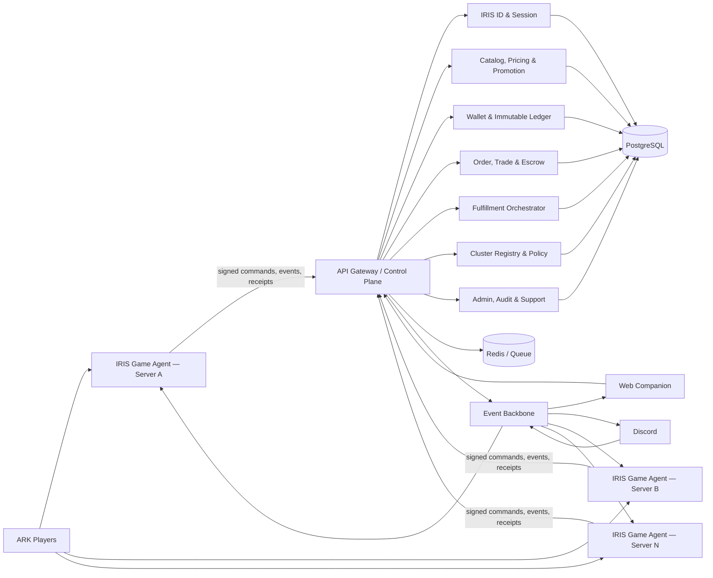

# IRIS Cluster Commerce Platform — Plugin-First Ecosystem Specification

อัปเดตจาก Product Vision วันที่ 11 กรกฎาคม 2026

เอกสารนี้กำหนดทิศทางหลักของ HeartShop ใหม่: ไม่ใช่ web shop ที่มี ARK plugin เป็นตัวส่งของ แต่เป็น **แพลตฟอร์ม commerce ของ ARK cluster ที่เราเป็นเจ้าของทั้งหมด** โดย plugin เป็นช่องทางหลักในเกมและเป็น trusted game execution agent ส่วน Backend, Web และ Discord ใช้ข้อมูลและ state machine ชุดเดียวกัน

## 1. North Star

ผู้เล่นต้องสามารถใช้ IRIS Account เดียวกันข้ามทุกเซิร์ฟเวอร์ใน cluster เพื่อ:

- ดูและใช้ IRIS Wallet
- ค้นหา เปรียบเทียบ และซื้อสินค้า
- รับ kit, item, dino, engram, service และ entitlement
- ส่งแต้ม ให้ของ แลกของ หรือซื้อขายกับผู้เล่นอื่นผ่าน escrow
- เลือกว่าจะรับของที่ server ใด โดยระบบตรวจ compatibility ให้อัตโนมัติ
- ติดตาม order, delivery, trade, return, refund และ dispute จากในเกม
- รับคำแนะนำและโปรโมชั่นที่สัมพันธ์กับตัวละคร แผนที่ server และสิ่งที่มีอยู่จริง
- ติดต่อ support และดู incident/maintenance โดยไม่ต้องออกจากเกม

ผู้ดูแลต้องสามารถควบคุม catalog, economy, wallet, delivery, marketplace, cluster policy, fraud, support และ operations จาก control plane เดียว โดยทุก action มี permission และ audit trail

## 2. Product Definition

ชื่อเชิงสถาปัตยกรรมที่ใช้ในแผน:

- **IRIS Commerce Control Plane:** Backend กลางที่เป็น source of truth ของ identity, wallet, catalog, price, order, trade, policy และ audit
- **IRIS Game Agent:** HeartShop C++ plugin ที่ติดตั้งบนทุก ARK server และทำ game mutation ตามงานที่ลงนามแล้ว
- **IRIS In-Game Commerce Shell:** command/session interface เริ่มจาก `/iris` ซึ่งทำธุรกรรมหลักได้ครบโดยไม่ต้องเปิดเว็บ
- **IRIS Web Companion:** storefront, account center, admin และหน้ารายละเอียดที่เหมาะกับจอใหญ่
- **IRIS Event Backbone:** transactional outbox และ workers ที่เชื่อม WebSocket, Discord, game messages, analytics และ reconciliation

ระบบต้องแทน ARK Shop เดิมทั้ง functional compatibility และ data continuity ไม่ใช่ติดตั้งคู่กันอย่างถาวร

## 3. Non-Negotiable Principles

1. **Plugin-first, backend-authoritative:** ผู้เล่นเริ่มและจบ flow ในเกมได้ แต่เงิน ราคา และ state ธุรกรรมตัดสินโดย backend
2. **Cluster-wide account:** wallet และ entitlement เป็นระดับ cluster; game asset และ delivery มี server ownership/routing ชัดเจน
3. **No duplicate effect:** retry หรือ timeout ทำซ้ำได้โดยไม่เพิ่มเงิน ส่งของ หรือลบ asset ซ้ำ
4. **Fail closed for value mutations:** เมื่อ control plane หรือ signature verification ใช้ไม่ได้ ห้ามซื้อ ขาย แลก หรือส่งของแบบ local fallback
5. **Browse gracefully:** network ขัดข้องอาจแสดง catalog cache แบบ read-only พร้อมเวลาที่อัปเดตล่าสุด แต่ห้ามยืนยันราคา/ยอด/สิทธิ์จาก cache
6. **One contract, many surfaces:** Plugin, Web, Discord และ Admin ใช้ state machine และ API contract เดียวกัน
7. **Explainable intelligence:** recommendation, promotion และ risk score ต้องอธิบายเหตุผลและมี guardrail; AI ห้ามแก้ wallet หรือ spawn asset โดยตรง
8. **Migration without value loss:** แต้ม kit ยอดใช้จ่าย catalog และ command aliases เดิมต้อง inventory, import และ reconcile ได้

## 4. Target Architecture

### Authority boundaries

| ข้อมูล/การกระทำ | Source of truth |
|---|---|
| IRIS identity, linked Steam/Epic/EOS | Control Plane |
| Wallet balances and ledger | Control Plane |
| Catalog, price, promotion, stock policy | Control Plane |
| Order, trade, escrow, refund status | Control Plane |
| Server/map/mod/capability availability | Cluster Registry + signed agent heartbeat |
| Player online state and current game object | Game Agent ของ server นั้น |
| Spawn/remove/apply game effect | Game Agent บน game thread |
| Durable game-effect receipt | Game Agent journal + Control Plane receipt |
| Notification history | Control Plane notification inbox |

## 5. Cluster Model

แต่ละ plugin instance ต้องประกาศ signed capability manifest:

- `clusterId`, `serverId`, server name, map และ environment
- plugin version, game build, ArkApi version และ protocol version
- installed mods/content packs และ compatibility hashes
- delivery capabilities เช่น item, dino, cryopod, engram, command, permission, buff และ kit
- feature flags และ maintenance/drain state
- current player count, queue pressure, last heartbeat และ clock skew

Control Plane ใช้ข้อมูลนี้เพื่อ:

- ซ่อนหรือ block สินค้าที่ server ปลายทางใช้ไม่ได้
- route delivery ไป server ที่ผู้เล่น online และรองรับ payload
- ไม่ส่งงานให้ agent version ที่ต่ำกว่าข้อกำหนด
- drain server ก่อน deploy/restart โดยหยุด claim งานใหม่
- แยก policy ต่อ PvE/PvP, map, season, server group และ cluster

### Cluster-wide semantics

- Wallet เป็นยอดเดียวระดับ cluster และห้ามมี local balance แยก server
- Product สามารถเป็น global, server-group, map-specific หรือ server-specific
- Entitlement เช่น VIP/rank อาจมี scope ระดับ cluster หรือ server และมี effective/expiry time
- Delivery job มี `targetServerId`, `eligibleServerGroup`, `playerIdentity`, `payloadHash` และ `deliveryKey`
- Asset ที่นำมาขายถูกผูกกับ origin server จนกว่า escrow/transfer จะเสร็จ
- Cross-server claim เปลี่ยน routing ได้เฉพาะก่อน game mutation และต้องสร้าง audit event

## 6. In-Game Commerce Shell

### Guaranteed baseline: server plugin only

Core flow ต้องใช้งานได้ด้วย chat commands และ paginated/session messages โดยไม่บังคับผู้เล่นติดตั้ง client mod:

| Command | หน้าที่ |
|---|---|
| `/iris` | dashboard: wallet, pending actions, delivery, offers, maintenance |
| `/iris shop [query]` | ค้น catalog ตามชื่อ tag category หรือ short code |
| `/iris item <code>` | ดูราคา รายละเอียด compatibility stock/policy และคำแนะนำ |
| `/iris buy <code> [qty] [server]` | สร้าง quote และเข้าสู่ confirmation session |
| `/iris confirm <token>` | ยืนยัน action ที่มีอายุสั้นและผูกกับผู้เล่น/ราคา/payload |
| `/iris cart` | ดู แก้ และ checkout cart |
| `/iris claim [order]` | claim delivery ที่ server ปัจจุบันรองรับ |
| `/iris orders [page]` | ดู order และ delivery timeline |
| `/iris kits` / `/iris kit <code>` | ดูและรับ kit/entitlement |
| `/iris send <player> <amount>` | ส่ง IC แบบ quote + confirmation + limits |
| `/iris trade ...` | direct trade/barter session และสองฝ่ายยืนยัน |
| `/iris market ...` | browse, list, offer, buy, cancel, claim, return |
| `/iris support ...` | เปิด ticket, แนบ reference และดูสถานะ |
| `/iris help [topic]` | help ตามบริบทและภาษาของผู้เล่น |
| `/iris admin ...` | health, queue, player/order lookup, drain/retry และ safe operator actions ตาม RBAC |

หลัก UX:

- mutation ทุกชนิดต้องแสดง quote ก่อน: สินค้า, จำนวน, server, ราคา, fee, discount, balance หลังทำ และ expiry
- confirmation token ใช้ครั้งเดียว มีอายุสั้น และผูกกับ Steam/EOS, server, action และ quote hash
- รองรับ pagination, short code, command suggestion, typo tolerance และ localized messages
- message สำคัญมี correlation/reference code เพื่อใช้กับ support
- alias คำสั่ง ARK Shop เดิม เช่น `/shop`, `/buy`, `/points`, `/kit`, `/trade` ชี้เข้าระบบใหม่ในช่วง migration
- ห้ามเก็บ raw player/controller pointer ข้าม asynchronous boundary; callback ต้อง resolve player ใหม่บน game thread จาก immutable identity

### Optional enhanced in-game UI

สามารถสร้าง client mod/UI layer สำหรับ catalog grid, cart, compare, trade panel และ notification center ได้ภายหลัง แต่ต้องเรียก Control Plane contract เดียวกัน และ plugin-only commands ต้องยังทำ core flow ได้ครบเสมอ

## 7. Commerce Capabilities

### First-party shop

Product types ที่ระบบควรรองรับผ่าน adapter/capability model:

- item/stack และหลาย item bundle
- dino/cryopod พร้อม stat, color, imprint และ mutation metadata
- kit แบบ one-time, cooldown, recurring, spawn-only หรือ permission-gated
- engram/unlock
- server command ที่อยู่ใน allow-list และมี typed parameters
- rank/group/permission entitlement แบบมีวันหมดอายุ
- buff, protection, rename, transfer หรือ service product
- subscription/season pass และ claimable reward
- coupon/voucher/promotion/bundle/gift

Product definition ห้ามเก็บเป็น free-form console command เพียงอย่างเดียว ต้องใช้ typed payload, schema version, capability requirement และ validation policy

### Player economy

- wallet transfer พร้อม daily limits, receiver confirmation option และ abuse controls
- direct trade: item/dino/IC หลายฝั่งพร้อม two-party quote
- marketplace fixed price, offer/counter-offer และ reserve purchase
- barter: asset-for-asset หรือ asset + IC ผ่าน escrow
- auction เป็น phase ภายหลังเมื่อ fixed-price escrow ผ่าน production แล้ว
- fees, taxes, seller proceeds, refunds และ compensation ลง double-entry ledger ทั้งหมด

### Reward economy

- timed play reward จาก signed, deduplicated playtime events
- kill/harvest/event/quest reward ผ่าน rule engine และ anti-farm policy
- daily/weekly/season mission และ streak
- referral/community/event rewards ที่มี budget และ expiry
- promotional balance แยกจาก refundable/available balance

### Cluster services managed by the platform

- centralized server configuration พร้อม version, staged rollout และ rollback
- player/tribe protection policy และ lifecycle ที่ใช้สถานะเดียวกันทั้ง cluster
- ranks, groups, permissions และ timed entitlements
- cross-server/Discord chat, moderation, mute/ban และ audit
- announcements, event schedule, maintenance/drain และ server status
- player join/leave/session presence สำหรับ routing delivery และ companion status
- reward schedules, quests และ cluster-wide campaigns
- operator actions ที่เป็น typed commands เช่น retry delivery, freeze account หรือ drain server; ห้ามเปิด arbitrary console/SQL จาก remote

คำว่า “จัดการทุกอย่าง” จึงหมายถึง control plane เดียวและ plugin modules ที่มี authority boundary ชัด ไม่ใช่ DLL monolith ที่ทุกโมดูลแก้ฐานข้อมูลหรือเรียกเกมได้โดยตรง

## 8. Smartest Shop — Intelligence Layer

คำว่า “อัจฉริยะ” ต้องสร้างประโยชน์โดยไม่เสี่ยงกับ financial/game integrity

### Context-aware discovery

- แนะนำเฉพาะสินค้าที่เข้ากับ map, server policy, installed mods และ player eligibility
- ใช้ purchase history, owned entitlements, recent activity และ stated preferences โดยมี privacy controls
- ตรวจสินค้าที่ซื้อซ้ำโดยไม่จำเป็น หรือมีของเทียบเท่าอยู่แล้ว และเตือนก่อนซื้อ
- แนะนำ bundle/kit ที่ประหยัดกว่ารายชิ้นพร้อมแสดงเหตุผลและส่วนต่าง
- semantic search ภาษาไทย/อังกฤษและ synonym ของ item/dino แต่ผลลัพธ์สุดท้าย map ไป catalog ID ที่แน่นอน

### Economy intelligence

- dashboard money supply, sinks/sources, velocity, concentration และ inflation signals
- demand/stock/fulfillment failure analytics แยก server/map/season
- promotion simulator และ guardrail ป้องกัน discount stacking ผิดพลาด
- anomaly/fraud detection สำหรับ transfer ring, webhook abuse, bot farming, price manipulation และ account linking risk
- price suggestion ให้ admin พร้อมเหตุผล; ห้าม AI เปลี่ยนราคาหรือ wallet โดยไม่มี policy/approval

### IRIS Concierge

AI concierge อาจช่วยค้นสินค้า อธิบาย compatibility สรุป order หรือแนะนำวิธีแก้ปัญหา แต่ต้อง:

- ใช้ retrieval จาก catalog/policy/order ที่ได้รับอนุญาต
- คืน structured intent ให้ deterministic service ตรวจอีกครั้ง
- แสดง quote และให้ผู้เล่นยืนยันก่อน mutation ทุกครั้ง
- ไม่มี credential, direct SQL, arbitrary console command หรือ direct spawn capability
- มี prompt/output logging แบบ redact, rate limit, safety policy และ fallback command UX

## 9. Game Agent Runtime Design

Canonical plugin ควรแยกโมดูลดังนี้:

- `AgentIdentity`: server credential, key rotation และ signed protocol
- `ClusterHeartbeat`: capability manifest, health, version และ drain state
- `CommandRouter`: `/iris` sessions, aliases, localization และ permission checks
- `QuoteClient`: request/confirm/replay-safe transaction quotes
- `DeliveryExecutor`: typed item/dino/kit/entitlement adapters
- `AssetEscrow`: prepare/remove/confirm/return journal สำหรับ P2P
- `GameThreadDispatcher`: resolve player/entity ใหม่และ mutate เฉพาะ game thread
- `DurableJournal`: prepared/applied/acknowledged/uncertain states พร้อม payload hash
- `EventCollector`: playtime/reward/chat/game events ที่มี server sequence และ dedupe key
- `NotificationInbox`: poll/ack in-game service notifications
- `PolicyCache`: signed read-only cache พร้อม version/expiry; ไม่มี authority ด้านราคา/เงิน
- `Diagnostics`: `/iris status`, health counters, last error และ support bundle ที่ redact secret
- `ProtectionModule`: player/tribe protection events และ policy enforcement
- `CrossChatModule`: signed chat relay, ranks, moderation และ delivery acknowledgements
- `AdminOpsModule`: typed, allow-listed operator commands พร้อม RBAC, approval และ audit

### Plugin safety policy

- ทุก delivery type ใช้ allow-listed adapter ไม่ deserialize arbitrary command
- จำกัด quantity, quality, level, stat, path และ payload size ตาม policy
- validate schema/version/hash ก่อน journal และก่อน mutation
- journal flush ต้องสำเร็จก่อนทำ irreversible mutation
- uncertain state ห้าม retry mutation อัตโนมัติ
- shutdown/drain หยุด claim งานใหม่ รอ in-flight ถึง safe checkpoint แล้ว persist
- API response จาก backend ไม่ถือว่าปลอดภัยโดยอัตโนมัติ; plugin ตรวจ scope และ capability ซ้ำ

## 10. Control Plane Domains

- Identity and account linking
- Cluster/server registry and agent credentials
- Catalog/PIM, price book and availability
- Promotion, voucher and eligibility engine
- Cart, quote and checkout
- Wallet, ledger, limits and reconciliation
- Order and fulfillment orchestration
- Entitlement, kit and cooldown service
- Trade, listing, offer, escrow, settlement and dispute
- Reward/rule engine and anti-farm controls
- Notification/outbox/inbox
- Support, moderation, audit and admin approval
- Search/recommendation/analytics
- Feature flag, kill switch and configuration distribution

Domain mutation ต้อง publish event ผ่าน transactional outbox ไม่เรียก Discord/WebSocket/plugin แบบ synchronous ใน transaction หลัก

## 11. Critical Transaction Flows

### In-game purchase

1. Plugin ส่ง identity, server context และ product query
2. Control Plane ตรวจ account, product, compatibility, limits, stock และ promotion
3. Backend คืน signed short-lived quote
4. Plugin แสดงราคา/ผลลัพธ์และรับ confirmation token
5. Backend consume token แบบ idempotent แล้วทำ ledger debit + order + fulfillment enqueue atomically
6. Agent ที่เหมาะสม claim delivery lease
7. Agent journal → game mutation → receipt → completion
8. Event Backbone อัปเดต timeline/notification/analytics

### Direct player trade/barter

1. ผู้เล่น A เปิด trade session และระบุ offer/request
2. ผู้เล่น B ยอมรับ invitation; backend lock quote version
3. Agent ของแต่ละ asset ทำ prepare-lock และ ownership check
4. เมื่อ asset locks ครบ ทั้งสองฝ่ายเห็น final quote/fees และยืนยัน
5. Backend atomically hold IC และ commit escrow state
6. Agents remove/source assets พร้อม durable receipts
7. Orchestrator ส่ง asset ไปผู้รับแต่ละฝั่ง
8. สำเร็จครบจึง settle; หากบางส่วนล้มเหลวให้ return/compensate ตาม state machine

### Control Plane outage

- `/iris` แสดงสถานะ unavailable และอาจ browse signed cache พร้อม timestamp
- ห้าม buy, transfer, list, trade, claim หรือ reward-credit แบบ local
- agent queue เฉพาะ non-value telemetry ที่มี bounded disk และ sequence
- delivery ที่ journal เป็น `applied` แล้วพยายามส่ง receipt ซ้ำ; ห้าม apply ซ้ำ
- operator เห็น outage/drain/recovery metrics และ reconcile หลังระบบกลับมา

## 12. Replacement and Migration from ARK Shop

### Inventory ที่พบใน workspace

- legacy catalog 754 รายการ: item 535, dino 151, unlock engram 68
- legacy config มี points, kits, timed reward, buy/sell/trade/search commands และ SQLite/MySQL options
- ทั้ง legacy `config.json` และไฟล์สำรองตั้ง `UseMysql: true` พร้อมค่า host, port, database, user และ password ครบ จึงต้องถือ MySQL เป็นแหล่ง migration หลักของ deployment นี้
- source ใน `HeartShop/HeartShop/Private/Main.cpp` กลับ hardcode `use_mysql = false` จึงมี config/source drift; ต้องยืนยันว่า production รัน `ArkShop` binary รุ่นใดและเขียน MySQL จริงก่อน snapshot/cutover
- SQLite ตัวอย่างมี schema `Players(SteamId, Kits, Points, TotalSpent)` และมี 0 rows แต่เป็นเพียง local fallback/copy ไม่ใช่หลักฐานว่ายอดผู้เล่น production เป็นศูนย์
- plugin ปัจจุบันมี `/claim`, `/points`, `/shop`, `/link`, `/protection`, `/sell`, `/market`, `/claimdino`, `/iris` แต่ shop/market UX ยัง redirect ไปเว็บและ `/iris` ยัง read-only

### Migration stages

1. **Discovery:** ใช้ MySQL config ที่พบเพื่อตรวจ connection, schema, players table และ server/plugin instances ที่กำลังเขียน โดยไม่พิมพ์ credential ลง log; เก็บเฉพาะ metadata ก่อนและหยุดการเขียนระหว่าง final snapshot
2. **Catalog converter:** แปลง ShopItems เป็น typed products; validate blueprint/type/price และสร้าง rejection report
3. **Identity mapping:** map SteamId/EOS ไป IRIS ID พร้อม collision/manual-review queue
4. **Opening balances:** import Points เป็น ledger opening entries ที่มี source snapshot hash; Kits เป็น entitlements/counters; TotalSpent เป็น historical metric ไม่ใช่เงิน
5. **Command compatibility:** alias คำสั่งเดิมไป IRIS flow พร้อมข้อความ deprecation
6. **Shadow mode:** IRIS คำนวณ balance/catalog/result เทียบของเดิมโดยยังไม่ mutate
7. **Freeze and reconcile:** freeze ARK Shop writes, final delta import, ตรวจ row count, sums, kit counts และ sample players
8. **Cutover:** disable ARK Shop mutation commands, enable IRIS by server group, monitor invariants
9. **Rollback window:** เก็บ snapshot แบบ immutable; rollback ต้องไม่เปิด writer สองระบบพร้อมกัน
10. **Decommission:** ถอน ARK Shop หลัง reconciliation window และ archive mapping/audit artifacts

### Migration acceptance

- catalog ทุก record ถูก imported หรืออยู่ใน signed rejection list ที่มี owner
- ผลรวม opening balance ตรง source ต่อ server/database
- ไม่มี SteamId ถูกผูกหลาย IRIS account โดยไม่มี resolution
- kit entitlement/cooldown/count ตรง source
- command aliases ครบเส้นทางที่ประกาศรองรับ
- หลัง cutover มี writer เดียวสำหรับ wallet, kit และ purchase

## 13. Plugin-First Delivery Program

| Milestone | Outcome | Production gate |
|---|---|---|
| PF0 Baseline | clean canonical plugin + protocol/version tests | fresh build, CTest, integration harness |
| PF1 Cluster Agent | signed identity, heartbeat, capability registry, drain | multi-server simulation + key rotation |
| PF2 In-Game Shell | `/iris` browse/search/quote/cart/order/help | core UX works without web/client mod |
| PF3 First-party Commerce | wallet debit, typed delivery, kits/entitlements | fault injection and zero duplicate effects |
| PF4 Legacy Cutover | catalog/points/kits/commands migrated | reconciliation + single-writer cutover |
| PF5 Player Economy | send IC, fixed-price market, offer, escrow/return | asset and ledger safety suite |
| PF6 Barter/Cluster Trade | asset+IC multi-party trades across servers | partial-failure compensation tests |
| PF7 Intelligent Shop | search, recommendations, economy/risk insights | explainability, privacy and policy guardrails |
| PF8 Full Operations | support/admin/notifications/SLO/DR | security, load, restore, canary sign-off |

## 14. Definition of Ecosystem Complete

จะเรียกระบบว่า ecosystem สมบูรณ์เมื่อ:

- ผู้เล่นทำ core commerce journey ได้ในเกมโดยไม่ต้องเปิดเว็บ
- server ทั้ง cluster ใช้ wallet, catalog, identity และ policy ชุดเดียว
- รองรับ replacement ของ legacy points/shop/kits/trade ที่ประกาศไว้ครบ
- first-party purchase, P2P sale, direct trade, return, refund และ dispute มี deterministic recovery
- เงินทุก movement อยู่ใน immutable ledger และ asset ทุก mutation มี durable receipt
- plugin crash/network timeout/server transfer ไม่ทำให้ส่งของหรือลบของซ้ำ
- catalog compatibility ถูกตรวจตาม server/map/mod/capability ก่อนซื้อและก่อนส่ง
- smart features อธิบายได้ มี consent/guardrail และไม่ถือ authority ด้านเงินหรือ game mutation
- admin ดูแล economy, cluster, fraud, support และ reconciliation ได้โดยไม่แก้ DB ด้วยมือ
- deployment, key rotation, backup, restore, rollback, monitoring และ incident response ผ่านการทดสอบ

## 15. Decisions to Confirm

แผนนี้ตั้งสมมติฐานว่า core commerce ต้องทำงานด้วย server plugin อย่างเดียว และ client mod เป็น optional enhancement สิ่งที่ต้องยืนยันก่อนล็อก UX/implementation:

- เกมเป้าหมายคือ ASA, ASE หรือรองรับทั้งสองสาย
- อนุญาต optional client mod สำหรับ full in-game UI หรือใช้ command/HUD เท่านั้น
- ขอบเขต cluster: cluster เดียวหรือหลาย cluster/season และ wallet ข้าม cluster ได้หรือไม่
- สินทรัพย์ใดซื้อขาย/แลกได้ และสิ่งใดห้ามตาม policy
- ต้องรองรับ item-for-item barter ตั้งแต่รุ่นแรกหรือเริ่มจาก fixed-price + IC
- MySQL endpoint/schema/table ตาม config ใดคือ production ปัจจุบัน และมี server/plugin instances ใดเป็น writer อยู่บ้าง
- command aliases เดิมที่ต้องรักษาแบบ 100%
- economy rules: earn sources, transfer limits, sinks, fees, expiry และ refundability
- AI personalization เป็น opt-in หรือเปิดโดย default พร้อมการควบคุมข้อมูลแบบใด
